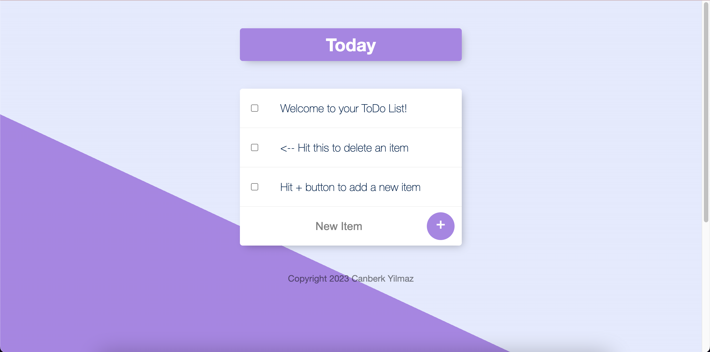
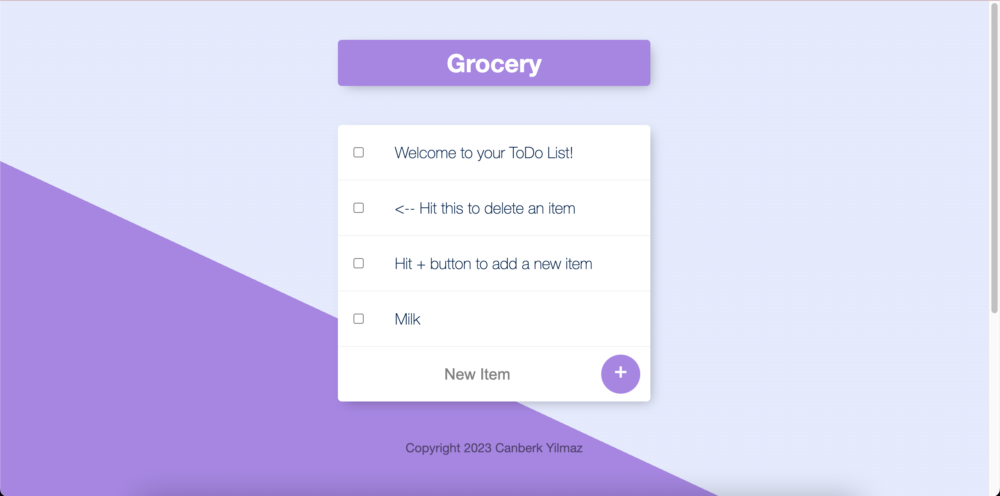
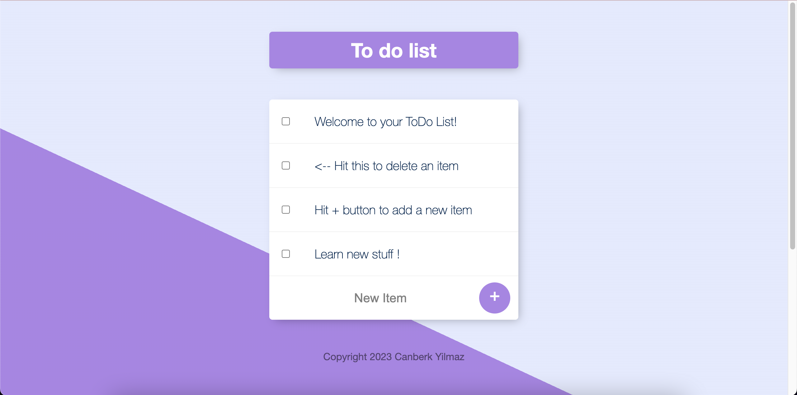

# ToDoList

To Do List Web App that can be used for taking notes that is deployed to Heroku.

The site website made by utilizing EJS, HTML, CSS, JavaScript, Bootstrap as well as MongoDB Atlas, NodeJS and NoSQL(MongoDB) for back-end.

Frameworks suchs as Express, Lodash and Mongoose implemented.

You can edit url to create and save your notes !

# Screenshot
Main Page (https://afternoon-scrubland-37013.herokuapp.com/)

Grocery (https://afternoon-scrubland-37013.herokuapp.com/Grocery)

Your List ! (https://afternoon-scrubland-37013.herokuapp.com/Canberk's%20list)

